class: center, middle, title-slide
background-color: black
background-image: url(image/intro_background.png)

# ISCB DC RSG 2016 Summer Workshop
## Co-expression network analysis using RNA-Seq data 
#### V. Keith Hughitt
##### June 15, 2016

<!--
TODO:

1) Shorten outline list?
2) Fix jitter in animations?

-->

---
# Outline

--
**1. Background**

--
- Types of biological networks

--
- Motivation for using co-expression networks

--
- Network inference and reverse engineering

--
- Basic graph terminology and data structures

--
- Steps for building a co-expression network

--
- Optimizing parameters for network construction

--
- Dataset for today's workshop


--
**2. Tutorial**

--
- Preparing RNA-Seq data for network construction

--
- Building a co-expression network

--
- Detecting co-expression modules

--
- Annotating a co-expression network

--
- Visualizing our network

---
# Types of Biological Networks

Biological networks have been used to study a range of processes in recent
years:

--
### Protein-protein Interaction Network (PPI)
<br /><br /><br />

.center[]

???
- Graphs/networks (useful link: https://shapeofdata.wordpress.com/2013/08/13/graphs-and-networks/)
- Vertices and Edges (nodes and links)
- Directed vs. Undirected.
- Weighted vs. Unweighted
- For our purposes: interested in representing relationship between numerous
  (molecules) in a cell, both in general, and across specific conditions,
  tissues, etc.

---
# Types of Biological Networks

Biological networks have been used to study a range of processes in recent
years:

### Co-expression Network
<br /><br /><br />

.center[]

---
# Types of Biological Networks

Biological networks have been used to study a range of processes in recent
years:

### Transcriptional-regulatory Network (TRN)
<br /><br /><br />


.center[]

---
# Types of Biological Networks

Biological networks have been used to study a range of processes in recent
years:

### Gene-regulatory Network (GRN)
<br /><br /><br />


.center[]

---
# Types of Biological Networks

Biological networks have been used to study a range of processes in recent
years:

### Metabolic Network 
<br /><br /><br />


.center[]

---
class: smaller

# What are co-expression networks useful for?

--
<span style='font-size:24px;'>Suppose we have a cell...</span>

.center[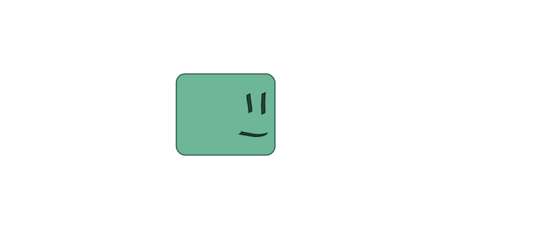]

--
.center[(Yes... that is a cell...)]

---
class: smaller

# What are co-expression networks useful for?

<span style='font-size:24px;'>Now suppose that cell encounters some stimulus...</span>

.center[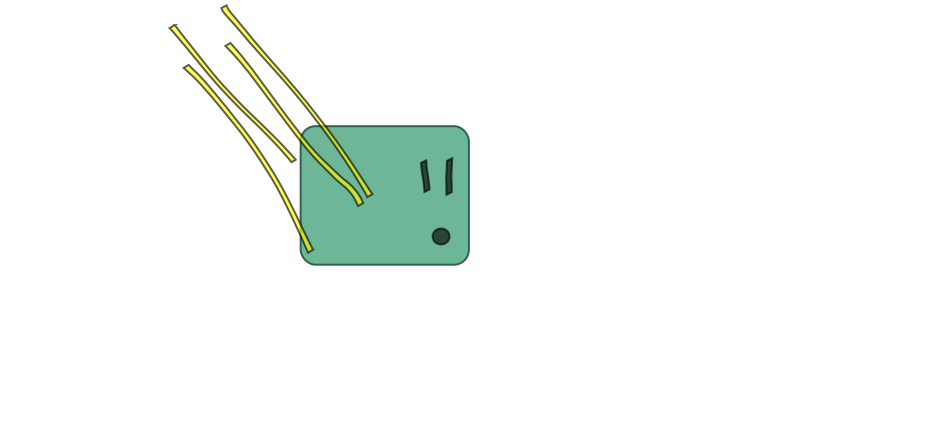]

---
class: smaller

# What are co-expression networks useful for?

<span style='font-size:24px;'>In response, some pathways may become activated...</span>

--

.center[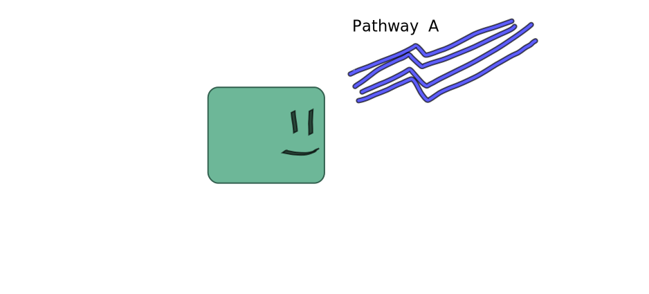]

---
class: smaller

# What are co-expression networks useful for?

<span style='font-size:24px;'>...Or deactivated.</span>

.center[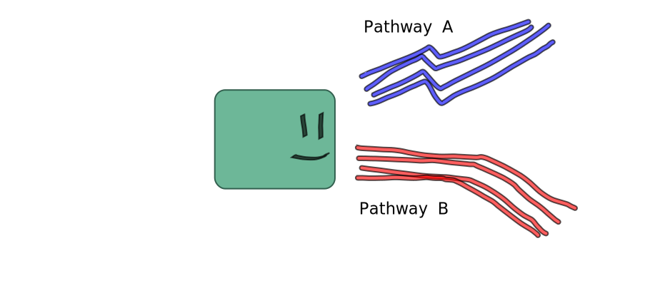]

---
class: smaller

# What are co-expression networks useful for?

<span style='font-size:24px;'>Now, suppose the cell encounters a different stimulus</span>

--

.center[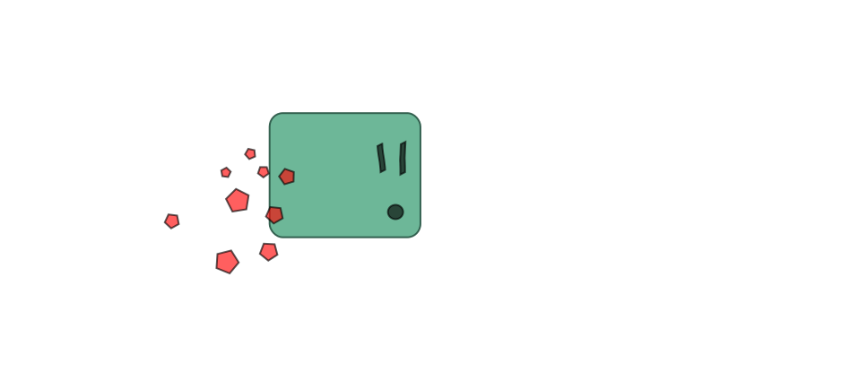]

---
class: smaller

# What are co-expression networks useful for?

<span style='font-size:24px;'>Its response may differ as well...</span>

.center[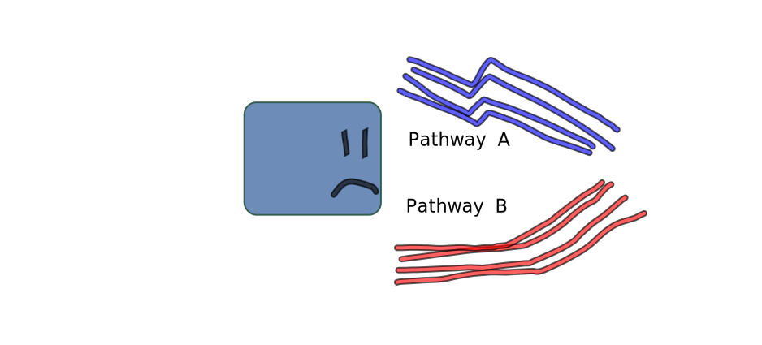]

---
class: smaller

# What are co-expression networks useful for?

- <span style='font-size:24px;'>The <span class='blue'>transcriptional
response</span> we see is dictated by an underlying <span class='blue'>gene
regulatory network (GRN)</span>.</span>
- <span style='font-size:24px;'>Co-expression network analysis provides us
  with insights into the underlying network, and into the groups of genes whose
  expression levels are <span class='red'>co-regulated</span>.</span>

<br /><br />

<div class='left-column vcenter' style='width:35%;'>
</img>
</div>

<div class='right-column vcenter' style='width:59%;'>
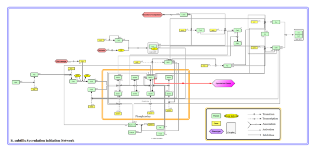</img>
</div>

<br />
<p style='color: #666;'><i>Bacillis subtilis</i> sporulation GRN (Source: <a href='https://commons.wikimedia.org/wiki/File:Gene_Regulatory_Network_for_Initiation_of_Sporulation_in_Bacillus_subtilis.png'>Wikipedia</a>)</p>

---
class: smaller

# What are co-expression networks useful for?

--
1. **Common approaches for analyzing expression data**

--
    - Differential expression analysis

--
    - Gene set enrichment analysis (GO/KEGG)

--
2. **Limitations of these approaches**

--
    - Typically limited to <span class='blue'>pairwise comparisons</span> (e.g. infected vs. uninfected)

--
    - Provides only a <span class='blue'>broad overview</span> of which genes or functions are up- and down-regulated between conditions

--
3. **Co-expression network analysis**

--
    - Uses expression data for <span class='red'>multiple conditions</span> (e.g. time-points) to infer relationships between genes.

--
    - Useful for understanding patterns in expression data at a more granular level

--
    - Can <span class='red'>detect sub-groups</span> corresponding to different expression profiles

--
    - Can be used to <span class='red'>infer function</span> of unknown gene products

---

# Network inference and reverse engineering

.left-column[

<h3 style='margin-top: 0px'>Co-expression network analysis</h3>

- Uses expression data only
- Infers <span class='blue'>_co-expression relationships_</span> between genes
- <span class='red'>Undirected network</span>
- Examples:
    - Relevance networks (Butte & Kohane, 2000)
    - WGCNA: Weighted Gene Co-expression Network Analysis (Zhang & Horvath, 2005)

]

.right-column.vcenter[
.hue-180[]
]

---
# Network inference and reverse engineering

.left-column[

<h3 style='margin-top: 0px'>Network inference / Reverse Engineering</h3>

- Uses expression data and possibly other sources of information: known TFs,
  ChIP-ChIP or ChIP-Seq, time, etc.
- Infers <span class='blue'>_causal_</span> relationships in the data
- <span class='red'>Directed network</span class='red'>
- May be referred to as _network inference_ or _reverse engineering_ methods:
  We are using the _observed_ expression data to _infer_ the underlying
  GRN which generated the observations.
- Examples: ARACNe, DISTILLER, cMonkey

]

.right-column.vcenter[
.hue-270[]
]

---
# Network representation (directed)

A network with `\(n\)` vertices can be represented by an `\(n \times n\)` matrix:

```r
set.seed(1)

# create a 5x5 binary matrix
adj <- matrix(sample(c(0,1), 25, replace=TRUE), nrow=5)

# set diagonal to zero (no self-loops)
diag(adj) <- 0
```

<br />

.left-column.vcenter[

### Adjacency Matrix

|   | V1| V2| V3| V4| V5|
|:--|--:|--:|--:|--:|--:|
|V1 |  0|  1|  0|  0|  1|
|V2 |  0|  0|  0|  1|  0|
|V3 |  1|  1|  0|  1|  1|
|V4 |  1|  1|  0|  0|  0|
|V5 |  0|  0|  1|  1|  0|

]

.right-column.vcenter[

]

---
# Network representation (undirected)

```r
# convert to undirected network
adj[upper.tri(adj)] <- 0

# plotting with igraph
g <- graph.adjacency(adj, mode='undirected')

plot(g)
```

<br />

.left-column.vcenter[

### Adjacency Matrix

|   | V1| V2| V3| V4| V5|
|:--|--:|--:|--:|--:|--:|
|V1 |  0|  0|  0|  0|  0|
|V2 |  0|  0|  0|  0|  0|
|V3 |  1|  1|  0|  0|  0|
|V4 |  1|  1|  0|  0|  0|
|V5 |  0|  0|  1|  1|  0|

]

.right-column.vcenter[

]

---
# Network representation (weighted)

```r
# create a weight adjacency matrix
adj <- matrix(rnorm(25, mean=3.5, sd=5), nrow=5)
adj[upper.tri(adj, diag=TRUE)] <- 0

# note that igraph ignores edges with negative weights
g <- graph.adjacency(adj, mode='undirected', weighted=TRUE)
plot(g, edge.width=E(g)$weight)
```

<br />

.left-column.vcenter[

### Adjacency Matrix

|   |    V1|   V2|    V3|    V4|    V5|
|:--|-----:|----:|-----:|-----:|-----:|
|V1 | -6.32| 7.25|  2.94| -5.36| -0.83|
|V2 |  2.68| 1.97|  5.66|  0.61| -1.36|
|V3 |  4.67| 3.77| -5.32| -1.57|  4.84|
|V4 |  8.80| 0.97|  1.13|  0.70|  8.40|
|V5 |  8.91| 6.24|  4.07| -2.61| 11.60|

]

.right-column.vcenter[

]

---
# Co-expression network construction

The major steps involved in building a co-expression network include:
--

1. Data pre-processing
--

2. Adjacency matrix construction
--

3. Network module detection

---
# Data pre-processing
--

- Select samples of interest
--

    - All samples
--

    - Samples related to phenomena of interest
--

- Filter low count genes
--

- Filter low-variance / non-DE genes
--

    - Limiting analysis to differentially expressed genes can lead to a more
      robust network.
--

- Log2-CPM
--

- Normalization

---

# Adjacency matrix construction

First, we need to select a similarity measure to use when comparing gene
expression profiles.

.left-column[
####Similarity measures

- Pearson correlation
- Spearman correlation
- Bi-weight Midcorrelation
- Euclidean distance
- Mutual information
- etc.
]

.right-column[
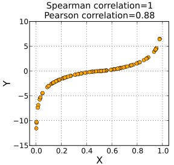
.center[(source: [Wikipedia](https://en.wikipedia.org/wiki/Spearman%27s_rank_correlation_coefficient#/media/File:Spearman_fig1.svg))]
]

---

# Adjacency matrix construction

Once we have generated our similarity matrix, it is often useful to transform
it in one or more ways.

--
#### Dealing with sign of correlations

--
- Unsigned: <span class='blue'>`\(|cor|\)`</span>

--
    - Gene pairs with positive and inverse correlations are grouped
        together.

--
- Signed: <span class='blue'>`\(\frac{cor + 1}{2}\)` </span>

--
    - Only genes with positive correlation grouped together

--
    - Information about negative correlations 
        

--
#### Eliminating spurious correlations

--
- Sigmoid transformation: <span class='blue'>`\(\frac{1}{1 + e^-x}\)`</span>

--
- Power transformation: <span class='blue'>`\(x^n\)`</span>

---
# Co-expression analysis

Let's start by simulating some "expression" data:
- **45 genes**
- **3 clusters** (high, medium, and low co-expression)

```r
genes_per_cluster <- 15
num_times <- 10

nvals <- genes_per_cluster * num_times
```

---
# Cluster 1 (highly co-expressed)

.center[]

```r
# highly co-expressed cluster; low->high expression
cluster1 <- matrix(rep(1:num_times, genes_per_cluster) + 
                   rnorm(nvals, sd=0.25),
                   nrow=genes_per_cluster, byrow=TRUE)
```

---
# Cluster 2 (moderately co-expressed)

.center[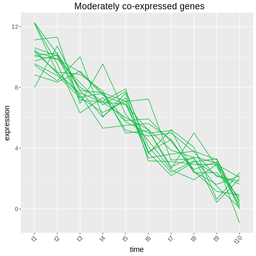]

```r
# moderately co-expressed cluster; high->low expression
cluster2 <- matrix(rep(num_times:1, genes_per_cluster) + 
                   rnorm(nvals, sd=0.75),
                   nrow=genes_per_cluster, byrow=TRUE)
```

---
# Cluster 3 (random)

.center[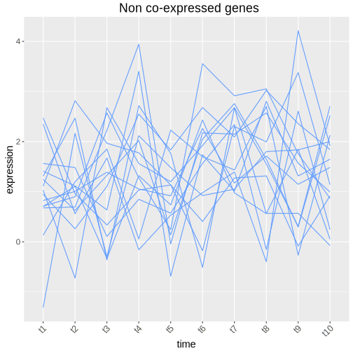]

```r
# randomly expressed genes
noise <- matrix(sample(1:2, nvals, replace=TRUE) +
                rnorm(nvals, sd=1),
                nrow=genes_per_cluster, byrow=TRUE)
```

---
# Putting it all together...

.center[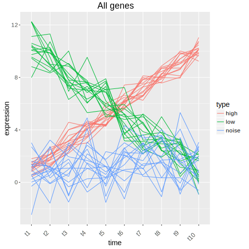]

---
# Correlation matrix (`\(S\)`)

Correlation matrix.

.center[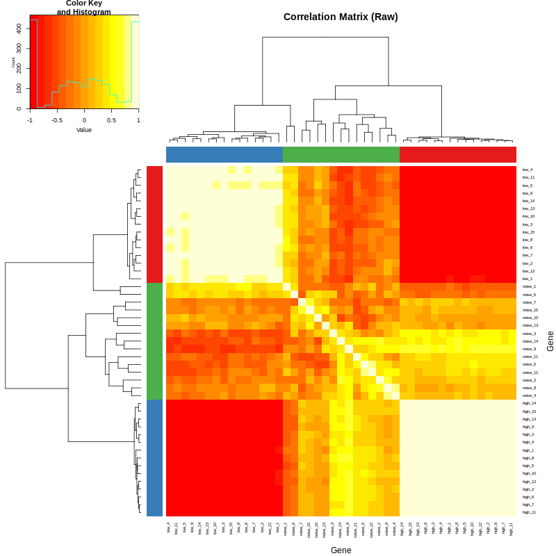]

---
# Correlation matrix (`\(S^n\)`)

After power transformation.

.center[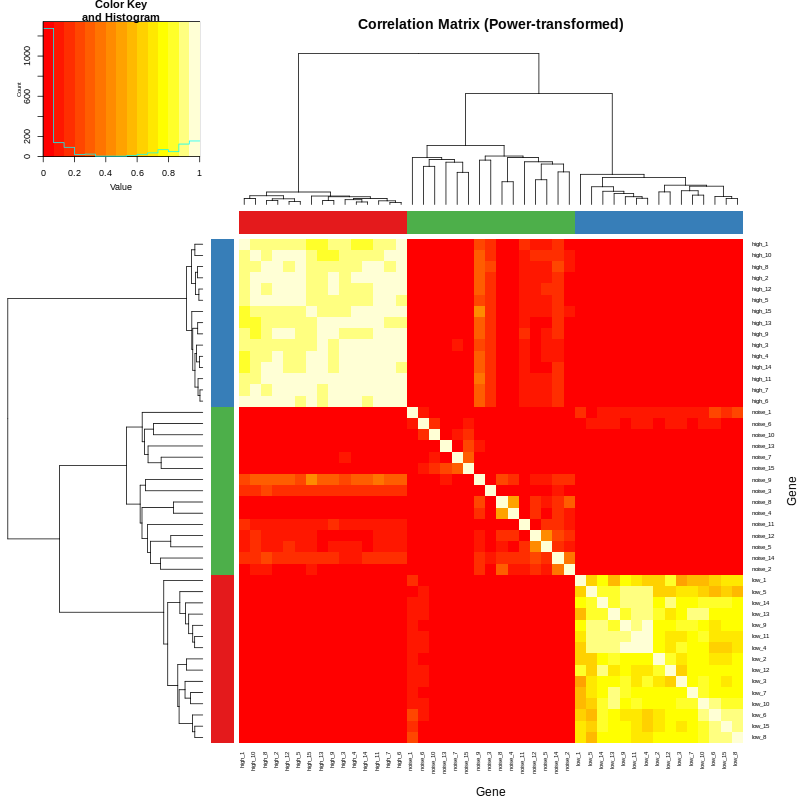]

---
# Module detection using Hierarchical Clustering

Genes are grouped together based on the similarity of their expression
profiles.

.center[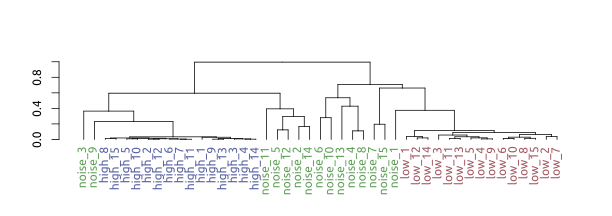]

```r
dissim_mat <- as.dist(1 - adj_mat)
dend <- as.dendrogram(hclust(dissim_mat))
```

---
# Module detection using Hierarchical Clustering

Modules are assigned by "cutting" the tree at a specified height: branches
below the cut height become separate modules.

.center[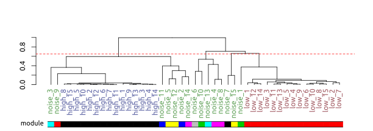]

```r
cutree(dend, h=0.65)
```

---
class: smaller-code

# Module detection using Hierarchical Clustering

Same thing as before, but this time using the power-transformed correlation matrix.

.center[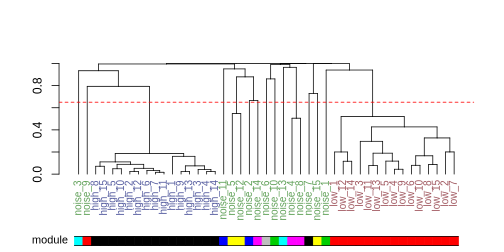]

```r
dissim_mat <- as.dist(1 - pow_mat)
dend <- as.dendrogram(hclust(dissim_mat))
cutree(dend, h=0.65)
```

---
class: center, middle

## Thank you!

---

## Acknowledgements


.left-column[
#### El-Sayed Lab

- Najib El-Sayed
- April Hussey, Lab manager
- Trey Belew, Ph.D., Post-doc
- Saloe Bispoe, Ph.D., Post-doc
- Maddy Paulson, Undergrad RA

#### Community

- MPRI
- CBCB
- BYOB
- ISCB
]

.right-column[
#### Collaborators

- Hector Corrada-Bravo (UMD)
- David Mosser (UMD)
- Volker Briken (UMD)
- Barbara Burleigh (Harvard)
- Rebecca Manning (Cinvestav)
- Jeronimo Ruiz (Fiocruz)
- David Sacks (NIH)
- Ehud Inbar (NIH)
]


